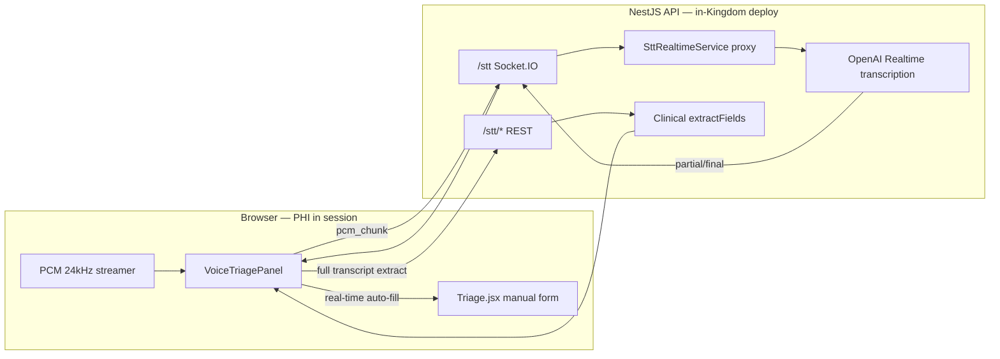

# Medical Voice-to-Text (STT) Triage Module

Production STT + live field extraction for TriagePulse CTAS intake (HMG / Riyadh ED context).

## Architecture



**Primary path:** OpenAI Realtime transcription (`gpt-live-transcribe`) proxied server-side — ChatGPT-like live deltas with manual audio commits (`turn_detection: null`; this model does not support server VAD). The browser never holds `OPENAI_API_KEY`.

**Fallback:** Browser Web Speech + 3s rolling REST `/audio/transcriptions` when Realtime is unavailable.

**PHI residency:** Mic audio streams through your API to OpenAI for transcription. Configure `OPENAI_API_KEY` only on PDPL-approved endpoints with a signed DPA. Without a key, the module falls back to browser speech + manual text — triage is never blocked.

## Components

| Layer | Path | Role |
|-------|------|------|
| Clinical extraction | `packages/clinical/src/stt/` | Bilingual rule/NER hybrid, JSON contract, SNOMED/ICD hints |
| API | `apps/api/src/stt/` | Sessions, Realtime proxy, REST batch STT, hybrid extract |
| Web capture | `apps/web/src/lib/stt/` | PCM streamer, browser STT fallback, MediaRecorder batch |
| UI | `apps/web/src/components/triage/VoiceTriagePanel.jsx` | Live transcript + field cards + completeness |
| Vocabulary | `config/stt-vocabulary.json` | Biasing terms for ASR |
| WER harness | `scripts/stt-wer-harness.mjs` | Labeled sample validation |

## Setup

```bash
cp .env.example .env
# Optional — server-side STT (PDPL-approved endpoint only):
# OPENAI_API_KEY=sk-...
# OPENAI_STT_MODEL=gpt-4o-mini-transcribe
# OPENAI_REALTIME_TRANSCRIBE_MODEL=gpt-live-transcribe
# OPENAI_REALTIME_DELAY=low
# OPENAI_REALTIME_VAD=off

npm run build --workspace=@triagepulse/clinical
npm run dev
```

Open `/triage`, tap **Start**, speak in English, Arabic, or mixed. Live transcript deltas appear within ~1s when Realtime is configured. Fields auto-fill as they are extracted (clinician review required before Confirm Triage).

On page load the panel calls `GET /api/stt/status`. If `realtime: true`, the badge shows **OpenAI Realtime (live)**. Otherwise browser + batch fallback is used.

## API

| Method | Path | Description |
|--------|------|-------------|
| GET | `/api/stt/status` | `{ configured, model, reachable, realtime, realtime_model, lastError? }` |
| POST | `/api/stt/session` | Create session (JWT + `perform_triage`) |
| POST | `/api/stt/extract` | Extract fields from transcript text |
| POST | `/api/stt/transcribe` | Batch transcribe base64 audio (fallback) |
| POST | `/api/stt/field` | Manual field override |
| WS | `/stt` | `realtime_start`, `pcm_chunk`, `realtime_stop`, `transcript_partial`, `transcript_final`, `extraction_update` |

## Output contract

See `packages/clinical/src/stt/types.ts` — matches BUILD PROMPT JSON (`session_id`, `fields`, `completeness`, `coded`, `low_confidence_spans`, etc.).

## Overwrite rule

Auto-fill updates a patient field only when the new STT confidence exceeds the last auto-fill confidence, or the field is empty. Manual nurse edits are tracked per field and are never overwritten unless **Re-sync now** is used.

CTAS completeness uses **10 required fields** (name, age, complaint, pain, HR, BP, SpO₂, RR, temp, GCS). Confirm Triage unlocks at 10/10.

## Testing

```bash
npm run build --workspace=@triagepulse/clinical
node scripts/stt-wer-harness.mjs
curl http://localhost:3001/api/stt/status   # requires JWT in prod; check configured/reachable/realtime
```

Restart API after `.env` changes: `npm run dev:api` (or `npm run dev` for both web + API).

## Safety

- Acuity (`acuity_proposed`) is **suggested only** — CTAS level requires clinician confirmation via existing `CTASValidation`.
- Low-confidence spans are flagged in the UI.
- All sessions are audit-logged (`stt_session_started`, `stt_transcribe_chunk`).
- No spoken GPT assistant / TTS — transcription-only for clinical dictation.

## Stack choice

NestJS + shared clinical package (not Python FastAPI) to keep one deployable unit with existing auth, Prisma audit trail, and CTAS engine. OpenAI Realtime is the primary streaming path; REST batch STT remains the fallback.
